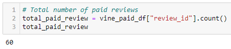
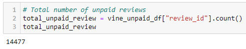
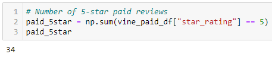
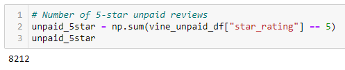
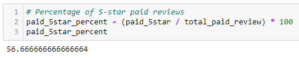
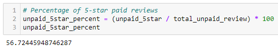

# Amazon Vine Analysis Using AWS RDS, SQL pgAdmin, and Pandas

## Overview of Amazon Vine Analysis

### Purpose
The purpose of this analysis is to analyze Amazon reviews written by members of the paid Amazon Vine program using a dataset of musical instruments.

## Results

### Number of Vine Reviews and Non-Vine Reviews

- Total Number of Vine Reviews

- Total Number of Non-Vine Reviews

### Number of 5 Star Reviews

- Total Number of Vine 5-Star Reviews

- Total Number of Non-Vine 5-Star Reviews

### Percentage of 5 Star Reviews

## Summary of Results

